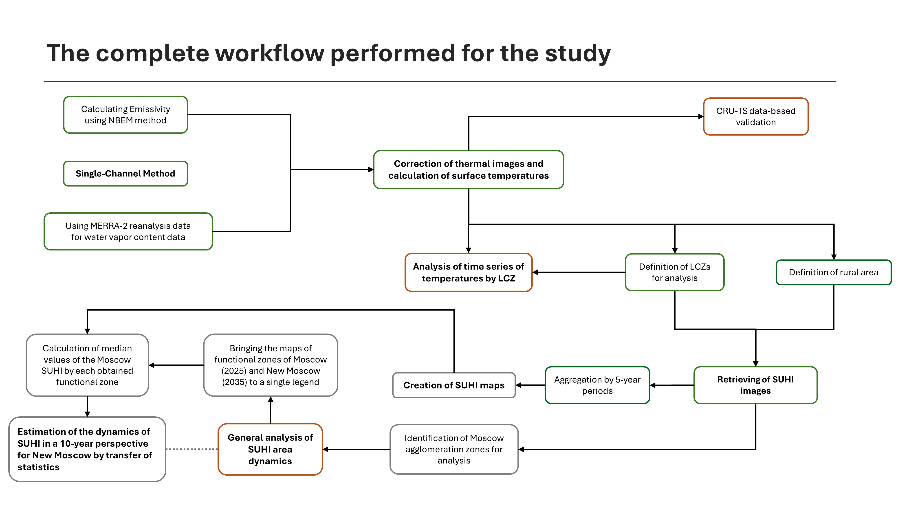

# Moscow_SUHI

Green: imlpemented via Google Earth Engine
Orange: implemented via Python (Jupyter Notebooks)
Gray: cannot be seen in this repository

## Description
Code used to get and analyse Moscow SUHI (Surface Urban Heat Island) in 1984-2024 using Landsat-5,8 data.
 
It's free to use for your own researches on SUHI anywhere on Earth.

# This data includes:
1. Anonymized Google Earth Engine (js) repository for raw data processing and receiving data for further analysis (*button below*)  

3. Jupyter notebooks (commented) used for data analysis, including:
   - CRU_TS_vs_LST_validation_en: CRU TS Reanalysis-based received data validation
   - lcz_time_series_analysis_en: average LST (land surface temperature) dynamics analysis by dedicated local climate zones
   - suhi_area_dynamics_en: general SUHI area dynamics analysis
 
Note that since I'm not really good at using JS, neural networks (ChatGPT, Grok) were actually used to get some parts of the JS code in Google Earth Engine.
 

## Look up to main input variables required to use GEE code in your ROI:
Algorithm for Landsat-5 & 8 Processing, atmospheric correction, summer SUHI calculation and clustering, some statistical calculations (mean LST, SUHI area) and export

### Main used parameters:
***GEOMETRY***:
 
1. var roi: ROI (Big Moscow)  
2. var rgnp: bounds for image search (Moscow center boundaries here)  
3. var rgnperc: bounds for ndvi 10 and 90 percentiles calculation (Moscow boundaries here)  
4. var agglomeration: parts of agglomeration inside ROI for analysis and statistics calculation (Big Moscow parts here)  
*includes fields:*  
-                      'agl': name of every agglomeration part
5. var lcz: polygons of local climate zones for statistics and clustering  
*includes fields:*  
-                       'id': unique id for each polygon
-                       'lcz': lcz class
-                       'name': unique name for each polygon
-                       'rus': unique name for each polygon in the second language
6. var rural: polygons of rural areas inside ROI for SUHI calculation
  ***OTHER:***
7. vars L5_START_YEAR, L5_END_YEAR = ... : Last years to search for images of Landsat 5 
8. vars L8_START_YEAR, L8_END_YEAR = ... : Last years to search for images of Landsat 8 
9. vars example_yearL5, example_yearL8, merged_example_year = ... : Years for visualization 
10. var periods: list of dictionaries with your time periods in format like [{start:y1, end:y2}, {start:y2+1, end:y3}, etc.]

